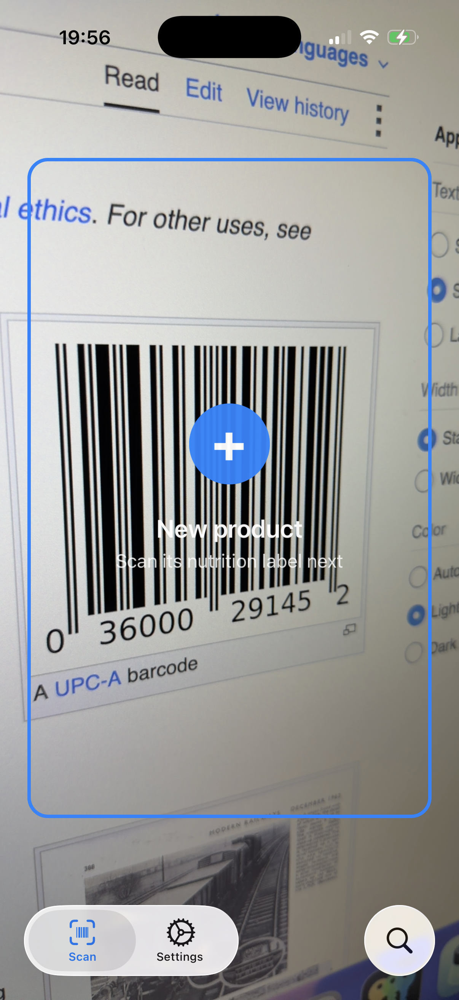
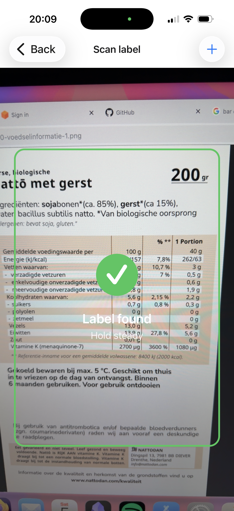
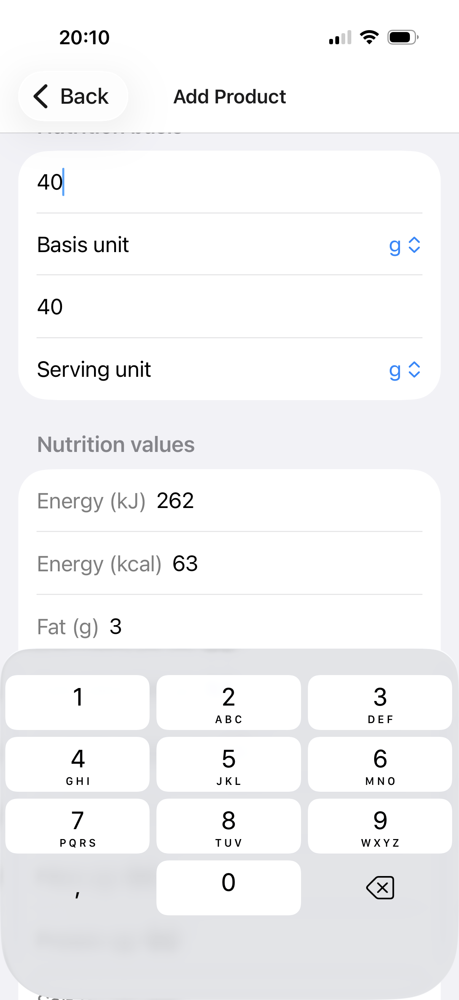
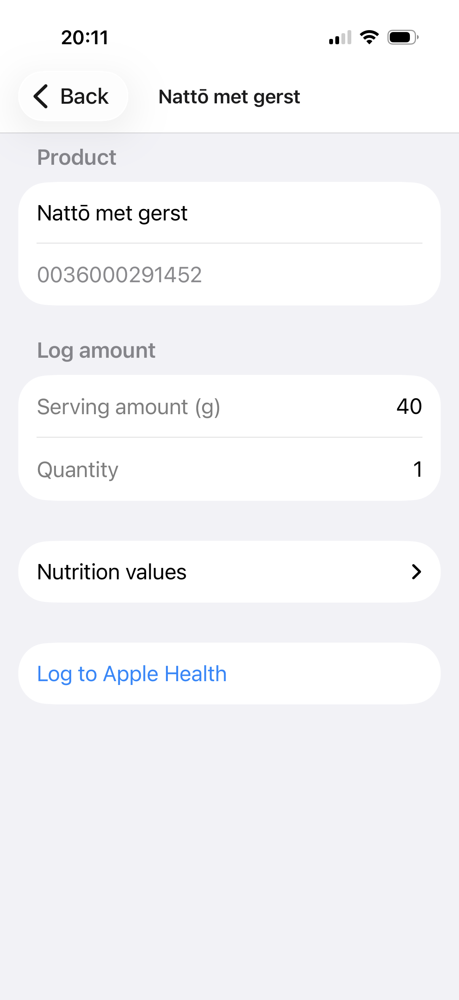
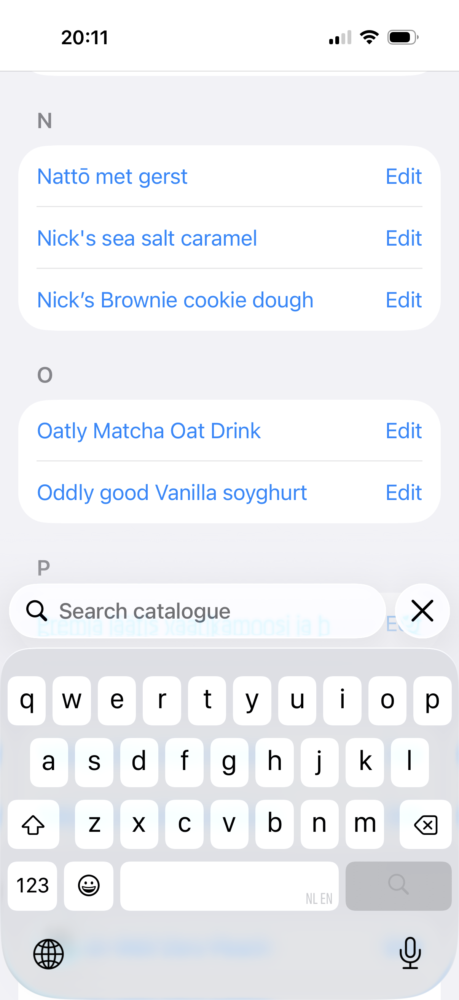
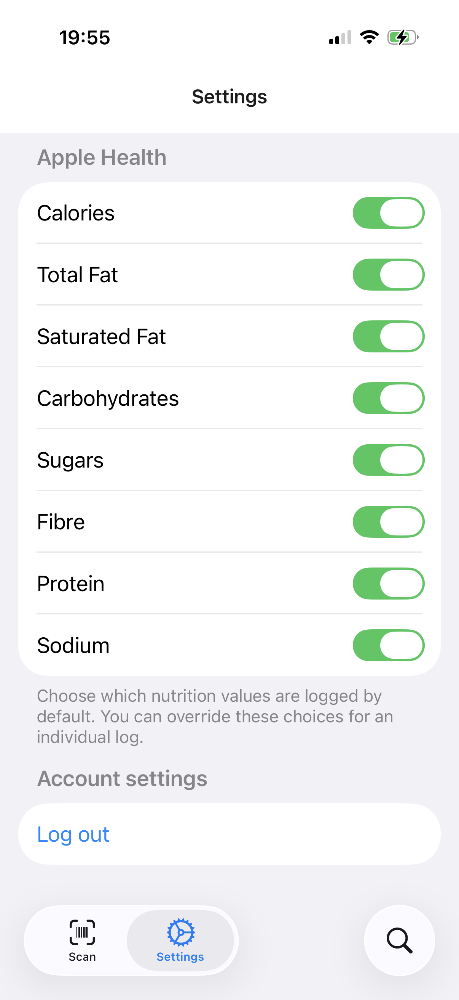

# LabelLog

LabelLog is an iOS app that scans nutrition labels and logs their values to
Apple Health.

## Motivation

Apple Health provides a useful place to track nutrition data, but entering
every value from a food label by hand is tedious. LabelLog automates that
process: scan a product's barcode (or a nutrition label), review the extracted
values, and save them directly to Apple Health. Your nutrition history and
overview remain in the Health app, so you do not need a separate analytics or
tracking app.

The app has been tested on iOS 16.4 and later.

## Features

- Scan product barcodes and nutrition labels with the camera
- Extract nutrition values using (iOS native) OCR and an LLM
- Review values before saving them
- Choose which nutrients to write to Apple Health
- Keep the product catalog on the device in a local SQLite database

## Screenshots

  
  
  

  
  
  

## Backend dependency

LabelLog requires the
[LabelLog Server](https://github.com/unematiii/log-label-server) for user
authentication and LLM-powered nutrition-label extraction. The server
currently uses Mistral API integration.
